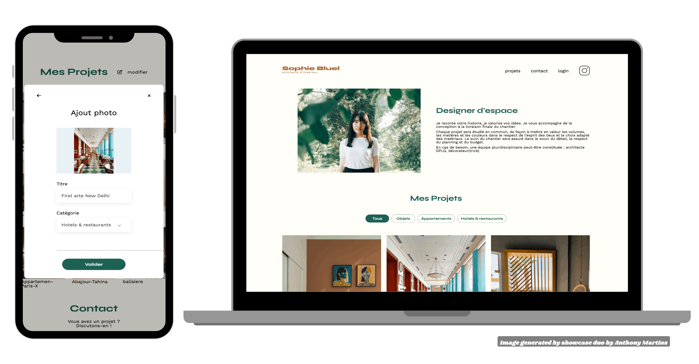

# Portfolio-architecte-sophie-bluel - Créez une page web dynamique avec JavaScript

## Aperçu du projet

## Description du projet

Réalisation dans le cadre de ma formation d'intégrateur web chez [OpenClassrooms](https://openclassrooms.com/fr/).  
Ce projet consiste à créer une page web dynamique pour le site d'une architecte d'intérieur en utilisant JavaScript pour manipuler le DOM et interagir avec une API.  
En tant que développeur front-end, ma mission principale est de transformer une page statique en une page interactive qui présente les travaux de l'architecte, intègre une page de connexion pour l'administrateur, et permet l'ajout de nouveaux médias via une modale.

## Maquette Figma 

[Maquette Portfolio-architecte-sophie-bluel sur Figma](https://www.figma.com/design/kfKHknHySoTibZfdolGAX6/Sophie-Bluel---Desktop)

## Objectifs

- **Gérer les événements utilisateurs avec JavaScript** : Implémenter des interactions dynamiques en capturant et en réagissant aux actions de l'utilisateur.
- **Manipuler les éléments du DOM** : Utiliser JavaScript pour créer, modifier et supprimer des éléments HTML afin de mettre à jour l'affichage de la page sans rechargement.
- **Communiquer avec une API** : Utiliser des requêtes HTTP pour récupérer, envoyer et modifier des données côté serveur, assurant la persistance des modifications apportées par l'utilisateur.

## Étapes du projet

1. **Mise en place de l'environnement de développement**
   - Installation de Node.js et npm pour faire fonctionner le backend.
   - Clonage du repo GitHub contenant le code de base et configuration des dépendances.
2. **Récupération des travaux depuis le backend**
   - Utilisation de fetch pour récupérer les données des travaux de l'architecte via l'API.
   - Affichage dynamique des projets dans une galerie en manipulant le DOM.
3. **Filtrage des travaux par catégorie**
   - Implémentation d'un menu de filtres pour trier les travaux par catégories.
   - Mise à jour de l'affichage de la galerie en fonction du filtre sélectionné.
4. **Création de la page de connexion**
   - Développement de la page de connexion pour les administrateurs.
   - Implémentation de la logique d'authentification avec gestion des erreurs de connexion.
5. **Ajout d'une fenêtre modale pour l'upload de médias**
   - Création d'une modale pour ajouter de nouveaux projets.
   - Gestion de l'apparition et de la disparition de la modale.
   - Validation et soumission des formulaires pour l'ajout de nouveaux médias.
6. **Suppression et Mise à Jour des Travaux**
   - Ajout de la fonctionnalité de suppression pour les projets existants.
   - Mise à jour dynamique du DOM après suppression ou ajout de projets, sans rechargement de la page.

## Résultats attendus

- **Page web dynamique et interactive** : Les utilisateurs peuvent visualiser et filtrer les travaux de l'architecte.
- **Authentification et gestion des médias** : Les administrateurs peuvent se connecter, ajouter et supprimer des projets via une interface intuitive.

## Outils utilisés

-  : Éditeur de code pour le développement.
-  : Outil de design pour accéder aux maquettes du projet.
-  : Pour le versionnement du code et la gestion du projet.
- **
 & ** : Outils de test pour les API.
-  : Pour les appels asynchrones à l'API REST.
- ** & ** : Pour gérer le backend et les dépendances.
-  : Langage de programmation principal pour la manipulation du DOM et les interactions avec l'API.

## Auteur

  
